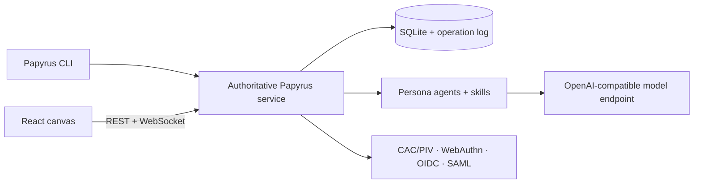

<p align="center">
  
</p>

<h1 align="center">Papyrus</h1>

<p align="center">
  <a href="https://app.fossa.com/projects/custom%2B63623%2Fgithub.com%2Fbeaglabs%2Fpapyrus?ref=badge_shield&amp;issueType=security">
    
  </a>
  <a href="https://app.fossa.com/projects/custom%2B63623%2Fgithub.com%2Fbeaglabs%2Fpapyrus?ref=badge_shield&amp;issueType=license">
    
  </a>
</p>

<p align="center"><strong>The local-first product-development canvas for regulated and disconnected teams.</strong></p>

<p align="center">
  Commercial · NIPRNet / IL4 · SIPRNet / IL6
</p>

Papyrus is a self-hosted, multiplayer workspace where product artifacts live on a typed directed canvas. Discovery, strategy, specification, design, engineering, validation, and transition artifacts remain connected; human and AI collaborators work against the same project state; and every generated change remains subject to human review.

Papyrus is designed for environments where cloud-only collaboration and public model APIs are not acceptable. Each agency or security boundary runs an authoritative Papyrus service and SQLite database. Authenticated browsers collaborate through server-sequenced WebSocket operations, while model access uses configurable OpenAI-compatible endpoints and the selected network profile constrains authentication, agents, and export behavior.

> **Development status:** active prototype. The repository demonstrates the architecture and security seams, but it is not currently represented as production-authorized, FedRAMP-authorized, or certified for a particular impact level.

## Architecture



The service is the deployment policy and coordination boundary. The `papyrus serve` command starts the API, authenticated collaboration hub, agent runtime, database migrations, and built browser application together. It enforces organization and project RBAC, persists authoritative project state and operations, records audit events, and runs human-reviewed agent workflows.

## Security model

### Profile-gated operation

`PAPYRUS_PROFILE` selects one of three deterministic deployment modes:

| Profile | Authentication | Model access | Connectivity |
| --- | --- | --- | --- |
| `commercial` | WebAuthn, OIDC, SAML | Customer-configured local or remote OpenAI-compatible endpoint | Customer-hosted HTTPS/WebSocket service |
| `niprnet-il4` | CAC/PIV, WebAuthn | Approved enclave endpoint | Enclave-local service only |
| `siprnet-il6` | CAC/PIV | Self-hosted endpoint inside the enclave | Disconnected enclave-local service |

The profile is an enforcement input, not a claim that Papyrus creates an IL4 or IL6 environment. The customer-owned deployment boundary, infrastructure, authorization, and operating procedures remain decisive.

### Identity and authorization

- CAC/PIV certificate parsing, validity checks, optional CA-bundle verification, and mTLS integration
- WebAuthn registration and authentication with configurable RP ID, RP name, and origin
- OIDC authorization-code flow with PKCE and signed-token validation
- SAML 2.0 request generation and signed response/assertion validation
- external-identity provenance bound to a Papyrus member public key
- organization membership and project-scoped role-based access control
- CSRF challenges, bounded authentication state, rate limiting, and session enforcement

### Authoritative data and synchronization

Project state, credential records, audit information, immutable canvas operations, and configuration are stored in the deployment's SQLite database. WAL mode supports concurrent readers while the service sequences writes. Browsers durably queue unacknowledged changes in IndexedDB, reconnect to the same authoritative service, and remove operations only after acknowledgement. Yjs updates provide collaborative specification editing; cursors and presence remain ephemeral.

### Agents, skills, and tools

Persona agents consume canvas context and produce proposed artifacts through explicit skills. The intended trust boundary requires endpoint allowlisting, tool authorization, human approval, input validation, secret redaction, execution limits, and auditable tool calls. Commercial endpoints can be replaced by customer-hosted OpenAI-compatible inference services for disconnected deployments.

### Audit and transfer

The service records security-relevant activity and supports audit-chain verification. Cross-domain bundles contain versioned operations signed by the source deployment identity and are accepted only from explicitly trusted deployment IDs. A transfer package still requires the customer's approved cross-domain process and does not replace a CDS or release authority.

## Monorepo

| Package | Responsibility |
| --- | --- |
| `engine/core` | Profiles, auth adapters, identity, RBAC-facing types, node catalog, sync protocol, transfer verification, and shared design tokens |
| `engine/daemon` | Authoritative HTTP/HTTPS and WebSocket service, migrations, SQLite operation/state persistence, Yjs documents, project APIs, audit, organizations, roles, auth, signed transfer, and SPA hosting |
| `engine/agents` | Persona agents, skill discovery/execution, model routing, and generated artifact workflows |
| `engine/web` | Vite, React, and XYFlow canvas; onboarding, auth, presence, persona history, editable product nodes, and collaboration UI |
| `engine/cli` | Local administration for licensing, projects, skills, artifacts, assets, organizations, and roles |

## Offline licensing

Papyrus validates licenses locally against the pinned Beag Labs Ed25519 authority key. Each installation generates a deployment identity; Beag Labs binds a 90-day pilot or perpetual organization license to that identity. Validation requires no network connection, and unlicensed deployments remain limited to health, diagnostics, activation request, and offline license installation.

See [Offline licensing and air-gapped activation](./docs/licensing.md).

## OSCAL and customer authorization support

The [`compliance`](./compliance) directory contains an OSCAL Component Definition covering 35 selected NIST SP 800-53 Revision 5 controls and a detailed shared-responsibility guide. It is intended to be imported and tailored within a customer-owned SSP; it is not an authorization or assessment result.

- [Papyrus OSCAL Component Definition](./compliance/papyrus-component-definition.json)
- [Security and tailoring guide](./compliance/README.md)
- [Human-readable Papyrus Trust Center](https://www.beaglabs.com/trust/papyrus)

## Development

Requirements: Node.js 22+ and pnpm 9.

```bash
pnpm install
pnpm cli serve --no-open
pnpm cli --help
pnpm smoke
pnpm test
pnpm typecheck
pnpm lint
```

Package scripts currently run directly from each workspace. Deployment-specific configuration, certificates, model endpoints, trusted transfer deployment IDs, and secrets should be supplied through the approved environment rather than committed to source.

## Trust boundaries and customer responsibilities

Papyrus supplies application mechanisms; the deployment owner supplies and authorizes the system around them. Customer responsibilities include host hardening, storage encryption, certificate and key custody, enterprise identity lifecycle, network segmentation, approved cryptographic modules, monitoring and retention, backup and recovery, vulnerability scanning of the deployed stack, model-server authorization, trusted deployment allowlisting, and any cross-domain transfer process.

## License

Copyright © Beag Labs, Inc. All rights reserved. Papyrus is not open-source software unless a separate written license explicitly states otherwise.
