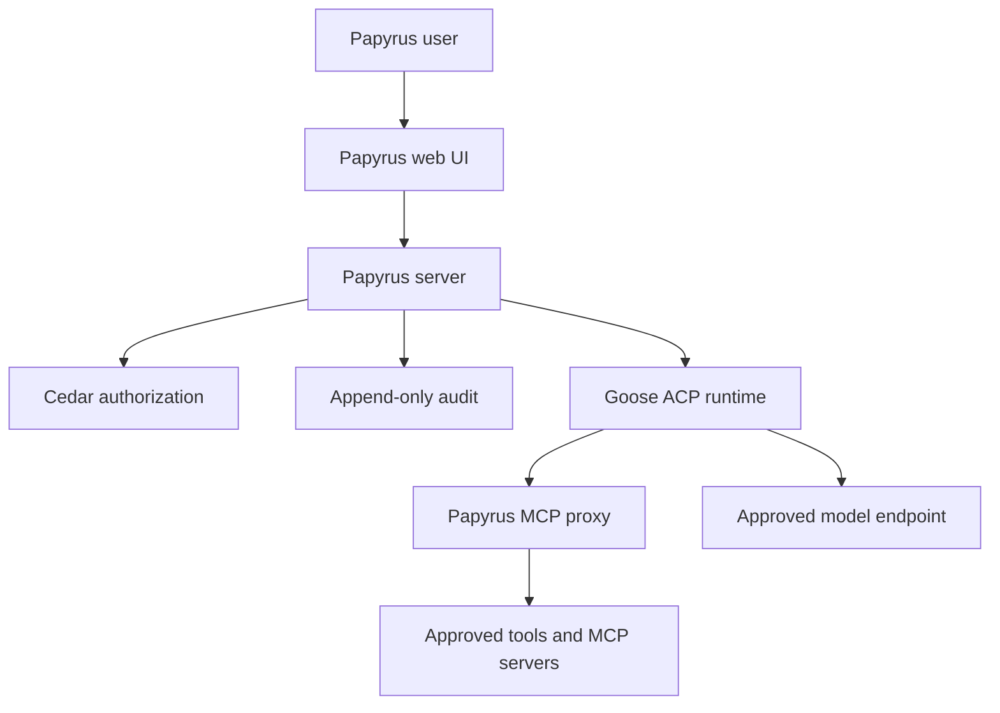

# Papyrus ACP Gateway: initial product scope

Status: accepted pivot baseline  
Branch: agent/acp-gateway-pivot  
Base ancestry: main  
Code reuse from main: none

## Decision

Papyrus will be a government-ready agent access and control plane, not a new agent harness.

The product presents a Papyrus-branded web application, authenticates the user, makes a Cedar authorization decision, provisions an authorized Goose session, and mediates access to models and MCP tools. Goose is the only agent runtime in the initial release and is treated as a pinned, replaceable dependency behind an ACP adapter.

The new branch intentionally starts with a clean file tree. Previous Papyrus code is reference material only and must not be copied into this implementation without a separate review.

## System boundary



Papyrus is authoritative for identities, roles, assignments, sessions, tool grants, policy decisions, audit metadata, runtime configuration, and license status. Goose is authoritative only for execution inside an authorized session.

A customer may supply a managed or enclave-local model endpoint. Papyrus does not serve models, schedule GPUs, train models, or require a public model provider.

## Initial domain model

- Deployment — one installed Papyrus security and licensing boundary.
- User — an authenticated human identity.
- Group — a flat collection of users used for assignment. Nested organizational structures are deferred.
- Workspace — the primary collaboration and segmentation boundary.
- Runtime — a configured Goose instance plus its approved model endpoint.
- Session — an ACP session owned by one user and attached to one workspace and runtime.
- MCP server — a configured tool server reachable through the Papyrus mediation boundary.
- Tool — an action exposed by an MCP server.
- Assignment — a user or group grant to a workspace, runtime, or MCP resource.
- Audit event — an immutable record of a security-relevant action or decision.

## Fixed initial roles

The initial policy bundle defines four roles. Customers can assign them but cannot edit their meaning in the first release.

| Role | Initial authority |
| --- | --- |
| Owner | Controls deployment bootstrap, licensing, owners/admins, security configuration, and all administrative visibility. |
| Admin | Manages users, groups, workspaces, runtime assignments, tool grants, and operational settings. Cannot replace the Owner or alter license trust roots. |
| User | Uses assigned workspaces, runtimes, and tools; creates and manages owned sessions. |
| Auditor | Reads authorized configuration, activity, policy decisions, and audit exports; cannot execute sessions or mutate resources. |

The first user does not become Owner merely by winning a login race. Owner bootstrap requires an explicit, single-use bootstrap secret created during installation. Bootstrap closes permanently after the first Owner is established unless an authenticated Owner initiates a documented recovery procedure.

## Authorization rules

Cedar is the sole application authorization decision point for protected actions.

Initial requirements:

- deny by default;
- authenticate before authorization;
- represent users, groups, workspaces, runtimes, sessions, MCP servers, and tools as typed Cedar entities;
- evaluate authorization in the server for every protected API operation;
- authorize session creation against both workspace and runtime assignment;
- authorize session reads against ownership, explicit administrative visibility, or audit authority;
- authorize tool discovery and invocation separately;
- never treat deployment profile, UI state, or possession of a resource identifier as authorization;
- record the policy bundle version, principal, action, resource, decision, and reason in the audit stream; and
- ship a versioned, tested policy bundle with no customer policy editor in the first release.

The application must not scatter role checks across route handlers. Routes call one authorization service, and tests exercise the Cedar schema and policies directly.

## Identity and deployment profiles

### Commercial profile

- OIDC authorization-code flow with PKCE.
- Issuer, audience, redirect URI, and claim mapping are installation configuration.
- Tokens are validated server-side.
- External groups may be mapped into Papyrus groups, but Papyrus assignments remain authoritative.

### Government profile

- CAC/PIV authentication through mutually authenticated TLS.
- Trust anchors, acceptable certificate policies, revocation behavior, and identity mapping are explicit installation configuration.
- If TLS terminates at an approved reverse proxy, the application accepts certificate identity only from an allowlisted, mutually authenticated proxy channel. Client-supplied forwarding headers are never trusted.
- The design supports disconnected revocation material and documented update procedures.
- IL4 and IL6 are deployment configuration baselines, not claims that the software is accredited or automatically suitable for a classified system.

OIDC and CAC establish identity. Cedar determines authority.

## Runtime and model boundary

Goose is the only runtime implementation in the initial release.

The packages/goose-runtime adapter will:

- pin a tested Goose release and record its license and software-bill-of-materials data;
- translate Papyrus session operations to a pinned ACP version;
- launch Goose as a loopback child process in local mode;
- connect to supervised Goose workers in persistent mode;
- pass only the selected model endpoint and authorized MCP configuration;
- normalize runtime events into Papyrus contracts;
- enforce timeouts, cancellation, health checks, and process cleanup; and
- reject runtime capabilities the pinned adapter does not understand.

Papyrus supports customer-controlled model endpoints through a small, explicit provider configuration contract. Runtime assignment includes the allowed model endpoint. Model credentials remain server-side and are never returned to the browser.

## Workspace, session, and activity visibility

A session has exactly one owning user, one workspace, and one runtime assignment.

Users can see their own sessions and usage within assigned workspaces. Admins and Owners can see deployment or workspace activity according to Cedar policy. Auditors receive read-only visibility. The UI must make the active user, fixed role, deployment profile, workspace, and runtime visible without exposing secrets.

Usage is derived from normalized runtime events and clearly labels values that a model endpoint does not report. Cost estimates are optional and must never be represented as billing truth.

## MCP and tool enforcement

Goose must not receive unrestricted direct access to customer MCP servers.

Papyrus provides a mediation layer that:

1. exposes only MCP servers assigned to the session;
2. filters tool discovery using the Cedar decision;
3. authorizes each invocation with user, workspace, runtime, session, server, and tool context;
4. applies configured argument and output limits;
5. records request metadata, decision, outcome, duration, and bounded result metadata; and
6. prevents secrets and unrestricted tool output from being copied into general audit fields.

If a transport cannot be mediated reliably, that transport is unsupported in the initial release.

## Append-only audit

Security-relevant events include authentication, bootstrap, assignment changes, authorization decisions, session lifecycle, runtime lifecycle, tool discovery and invocation, configuration changes, license changes, and audit export.

Initial guarantees:

- inserts are append-only through the application API;
- ordinary application roles cannot update or delete audit rows;
- each deployment event receives a monotonic sequence and previous-event hash;
- hashes cover a canonical event envelope;
- sensitive payloads are redacted or stored in a separately governed evidence store;
- persistent mode can export signed checkpoints for external retention; and
- audit integrity is testable, but described honestly: a database administrator can still tamper with a database unless events or checkpoints are exported to independently controlled storage.

Audit recording for a denied request must not depend on the denied transaction succeeding.

## Operating modes

### Local mode

A single command launches the Papyrus server, web UI, local database, and pinned Goose child process. Services bind to loopback by default. State persists in an explicit Papyrus data directory unless the user selects an ephemeral development option.

### Persistent server mode

A long-running, single-deployment service supports multiple users, durable relational storage, externally managed TLS, OIDC or CAC/mTLS, supervised Goose workers, backups, audit export, and administrative operations. This is not a multitenant SaaS control plane.

Both modes use the same domain services, Cedar policies, contracts, migrations, and audit semantics.

## Signed offline licensing

The initial license is an offline-verifiable signed document bound to a deployment identity.

It contains a license identifier, licensee, deployment identifier, allowed deployment profile, issued time, optional expiry, and explicit feature entitlements. Verification is fail-closed for gated operations and does not require a network call. Private signing keys never ship with Papyrus.

License enforcement is separate from Cedar:

- the license decides whether a product capability is entitled;
- Cedar decides whether the authenticated principal may use that capability.

Key rotation, recovery, clock rollback behavior, and air-gapped activation/export procedures require tests and operator documentation before release.

## Repository organization

The initial implementation deliberately uses a small number of packages:

```text
apps/
  web/                 Papyrus React UI
  server/              API and all security-sensitive server modules
packages/
  contracts/           Versioned API, ACP-normalized event, and audit contracts
  goose-runtime/       Goose lifecycle and ACP adapter
```

Server modules remain cohesive inside apps/server:

```text
src/
  auth/
  policy/
  workspaces/
  runtimes/
  sessions/
  mcp/
  audit/
  licensing/
  persistence/
```

Dependency direction is one way: web depends on contracts; server depends on contracts and goose-runtime; goose-runtime depends on contracts. The web UI never imports server implementation. Goose-specific types do not escape the runtime adapter.

## Delivery slices

### Slice 1: executable boundary

- Create the new workspaces and CI.
- Serve the branded web shell and health/readiness endpoints.
- Define versioned contracts.
- Launch and stop a pinned Goose process through the adapter.
- Complete one local ACP session without authentication.
- Mark every endpoint as development-only until identity and policy enforcement land.

Exit: a local developer can start Papyrus, create one session through the server, receive normalized events, cancel it, and observe clean process shutdown.

### Slice 2: identity and bootstrap

- Implement commercial OIDC.
- Implement government mTLS certificate identity extraction.
- Add explicit Owner bootstrap.
- Add fixed users, groups, and roles.
- Remove all unauthenticated session operations.

Exit: authentication tests cover issuer/audience failure, certificate trust failure, header spoofing, bootstrap replay, and profile mismatch.

### Slice 3: Cedar and assignments

- Add the Cedar schema, fixed policies, and authorization service.
- Add workspace and Goose runtime assignments.
- Assign approved model endpoints.
- Enforce session ownership and administrative visibility.

Exit: an authorization matrix test proves default denial and cross-workspace isolation.

### Slice 4: MCP mediation and audit

- Route configured MCP access through Papyrus.
- Enforce server and tool permissions.
- Add append-only, hash-chained audit events.
- Add user activity and administrative activity views.

Exit: a user cannot discover or invoke an unassigned tool, and every allow/deny decision produces a verifiable audit event.

### Slice 5: persistent deployment and licensing

- Add durable server-mode persistence and migrations.
- Add runtime supervision, backup, recovery, and audit export.
- Add signed offline activation and enforcement.
- Produce deployment documentation, SBOMs, and security tests.

Exit: the same conformance suite passes in local and persistent modes, and a disconnected deployment can install and validate a license without network access.

## Deferred scope

The following are intentionally outside the first release:

- arbitrary customer-defined Cedar policies or a policy editor;
- ACP runtimes other than Goose;
- automated cross-domain transfer;
- organization hierarchies more complex than flat groups;
- generic workflow building;
- an agent marketplace; and
- full multitenant SaaS administration.

Automated cross-domain movement must not be implemented as an ordinary network integration. Any future feature requires a customer-approved cross-domain solution, transfer policy, content inspection, release authority, and deployment-specific accreditation.

## Release gates

The initial scope is complete only when:

- all twelve initial capabilities have end-to-end acceptance tests;
- authorization is deny-by-default with matrix coverage;
- sessions and MCP calls cannot bypass the Papyrus server;
- local and persistent modes share policy and audit behavior;
- offline licensing works with no network dependency;
- dependency versions and third-party notices are reproducible;
- secrets are absent from browser payloads and ordinary audit events;
- backup and recovery preserve audit ordering and integrity; and
- documentation states what has and has not been assessed or authorized.
