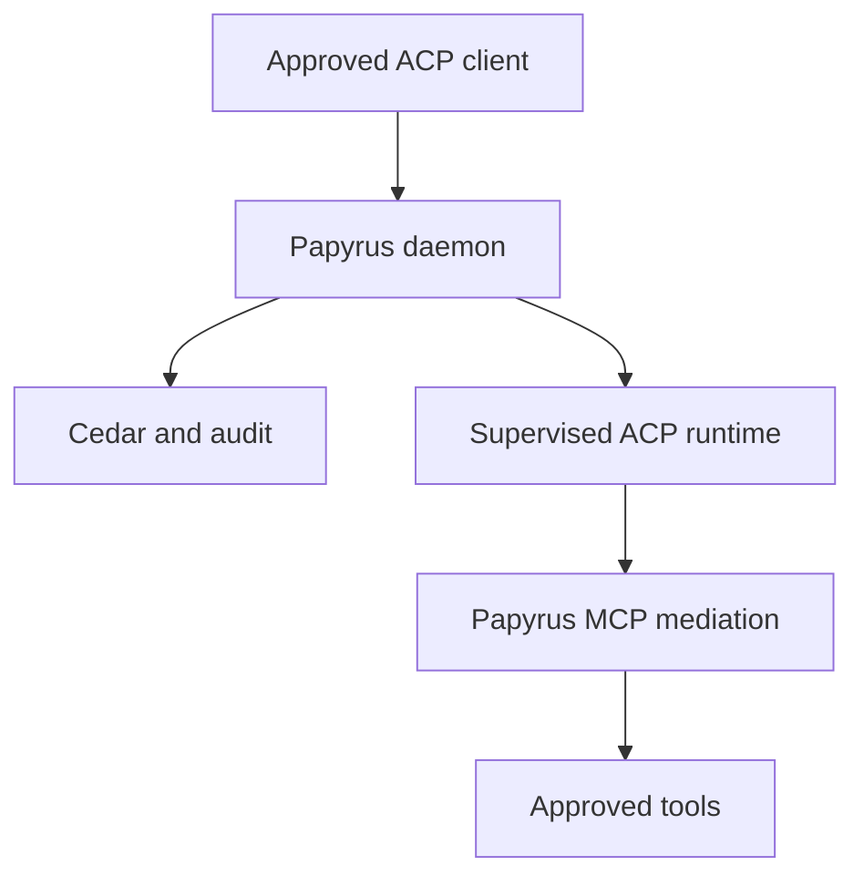

# Papyrus ACP daemon: product scope

Status: accepted daemon-first baseline

## Decision

Papyrus is a secure ACP daemon and policy enforcement boundary for regulated and disconnected environments. It is not a new agent harness, chat application, browser session UI, model server, or workflow builder.

Approved clients connect to Papyrus. Papyrus authenticates the principal, evaluates Cedar policy, owns the governed session record, supervises or connects to an approved ACP runtime, mediates MCP access, and records security-relevant events.

The implementation uses the official stable `@agentclientprotocol/sdk` as its protocol boundary. Goose remains a supported adapter, not the product architecture.

## System boundary

Papyrus is authoritative for:

- identities, fixed roles, groups, workspaces, and assignments;
- runtime and connector profiles;
- session ownership and lifecycle metadata;
- policy decisions and tool grants;
- license status; and
- append-only audit events.

The selected ACP runtime is authoritative only for agent execution within the authorized session. A customer supplies an approved managed or enclave-local model endpoint. Papyrus does not serve or train models.

## Daemon interfaces

Papyrus exposes three distinct boundaries:

1. **Administrative API** for identity, assignments, configuration, licensing, health, and audit.
2. **ACP client gateway** for local or remote approved clients.
3. **Runtime transport** for supervised local stdio processes or authenticated remote Streamable HTTP runtimes.

A small local connector may translate stdio ACP into authenticated remote ACP for clients that can only spawn a local command. The connector contains no agent logic and receives only the credentials and configuration needed for its connection.

Web chat, web session UX, first-party browser automation, and a browser extension are outside the current stack.

## Identity

Commercial deployments use OIDC authorization code with PKCE. Government deployments use CAC/PIV certificate identity through mutually authenticated TLS. A deployment may federate certificate identity into OIDC when its approved identity provider supports that pattern.

If TLS terminates at a reverse proxy, Papyrus accepts forwarded certificate identity only over an allowlisted mutually authenticated boundary. Client-supplied identity headers are never trusted.

Authentication establishes identity. Cedar determines authority.

## Authorization

Cedar is the sole application authorization decision point for protected actions. The initial policy bundle has fixed Owner, Admin, User, and Auditor roles and is deny-by-default.

Authorization covers administrative APIs, workspace and runtime assignments, session creation and access, runtime connection, MCP discovery, and every tool invocation. Decisions record the policy bundle version, principal, action, resource, outcome, and bounded reason.

## Sessions

A governed session has one owner, workspace, runtime assignment, and connector identity. Session state is durable enough to reconnect clients and resume when the selected runtime supports it.

Papyrus persists normalized lifecycle events, approvals, tool activity, and bounded runtime metadata. This event model is an API and daemon capability; it does not imply a Papyrus chat UI.

## ACP transports

- Local runtimes use ACP over stdio with framed JSON messages, cancellation, process supervision, and cleanup.
- Remote runtimes use authenticated ACP Streamable HTTP as the primary transport.
- WebSocket remains a compatibility transport where ACP clients or runtimes require it.
- Remote transports use connection identifiers, explicit timeouts, bounded messages, and mTLS or approved workload identity.

Transport authentication is separate from the ACP session model.

## Browser capability

Browser capability is supplied through an approved runtime or MCP server such as Chrome ACP. The external proxy and local connector provide the protocol path; the adapter catalog provides launch and policy profiles.

Papyrus does not embed a browser, ship a browser extension, or treat browser actions as implicitly trusted. Navigation, downloads, credential use, filesystem transfer, and external submission remain separately authorizable actions.

## Licensing invariant

Local mode may run without a commercial license for development and evaluation.

Persistent mode always requires a valid signed offline license. There is no environment variable that disables this requirement. License entitlement and Cedar authorization remain separate: a license enables a product capability; Cedar determines whether a principal may use it.

## Hardened deployment

The production container will derive from a pinned Node 24 Minimus `reg.mini.dev/node-fips` image. The derived image must independently verify FIPS operation, run non-root, minimize writable paths and Linux privileges, contain no build toolchain or secrets, and publish Papyrus-specific SBOM, provenance, signature, vulnerability, and compliance evidence.

## Deferred scope

- Papyrus chat or web-session UI;
- first-party browser automation or extension;
- arbitrary customer-editable Cedar policies;
- generic workflows or an agent marketplace;
- serving, scheduling, or training models;
- horizontal multitenant SaaS;
- automated cross-domain transfer; and
- accreditation claims.

## Release gates

The daemon-first stack is complete when:

- protocol conformance tests pass for local stdio and remote Streamable HTTP;
- at least one non-Goose adapter runs through the runtime-neutral core;
- external clients can connect without Goose-specific environment variables;
- authentication, authorization, session ownership, and tool mediation cannot be bypassed;
- every security-relevant allow or deny produces a verifiable audit event;
- persistent mode cannot disable license validation;
- the browser profile works through the proxy and catalog without a Papyrus browser UI; and
- the signed, derived Minimus image passes the documented FIPS and hardening checks.
